# IntelliCore: Enterprise AI Knowledge Management System

IntelliCore is a production-grade Enterprise Knowledge Management System (KMS) built with a multi-agentic RAG architecture. It leverages the Model Context Protocol (MCP) concepts and LangGraph to provide accurate, reliable, and observable enterprise policy information to employees and administrators.

## 🚀 Overview

IntelliCore streamlines policy management operations by providing an intelligent interface for policy retrieval, automated gap detection, and employee support. It features a state-of-the-art RAG pipeline that can process both text and visual data (charts, tables) from enterprise documents.

### Key Concepts Covered

- **RAG (Retrieval-Augmented Generation)**: Implements a high-performance retrieval system using **ChromaDB** as a vector store and **Sentence-Transformers** for embedding generation. The system supports multi-modal ingestion, where text and visual elements (like charts or tables) are extracted from PDFs via **Vision AI**, vectorized, and then retrieved based on semantic similarity.
- **Agentic Framework**: Built with **LangGraph** for structured, stateful multi-agent workflows.
- **Multi-Agent Systems**: Features specialized agents for retrieval, QA, and validation.
- **Model Context Protocol (MCP)**: Adheres to the principles of the **Model Context Protocol** by decoupling model reasoning from data sources.
- **Guardrails**: Implementation of input validation and output hallucination checks.
- **Observability**: Real-time logging of queries, confidence scores, and system metrics via MongoDB.

---

## 🏗️ Architecture

IntelliCore follows a modern decoupled architecture designed for scalability and observability.

<p align="center">
  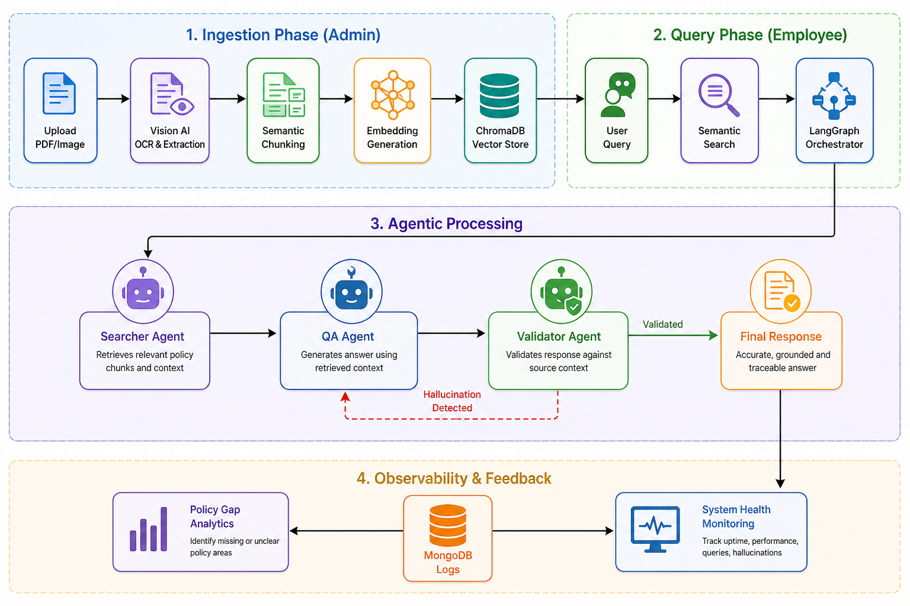
</p>

### Tech Stack Summary

| Component | Technology | Description |
| :--- | :--- | :--- |
| **Frontend** | React, Vite, Tailwind CSS | Modern, responsive dashboard and chat interface. |
| **Backend** | FastAPI (Python) | High-performance API orchestrating the AI agents. |
| **Orchestration** | LangGraph, MCP | Stateful multi-agent workflows and tool standardization. |
| **Vector Store** | ChromaDB | Local vector database for sub-second semantic search. |
| **Primary DB** | MongoDB | Persistent storage for user data, logs, and analytics. |
| **LLMs** | Llama 3.3 70B (Groq) | High-speed inference for reasoning and generation. |
| **Vision AI** | Llama 3.2 Vision | Processing of visual elements in policy documents. |

---

## 📂 Project Structure

```text
.
├── assets/             # Project screenshots and diagrams
├── backend/            # FastAPI server and AI logic
│   ├── mcp/           # Model Context Protocol tool implementations
│   ├── rag/           # RAG pipeline and vectorization logic
│   ├── tests/         # Backend unit and integration tests
│   └── main.py        # Entry point for the backend
├── frontend/           # React application
│   ├── src/           # Component and page source code
│   └── public/        # Static assets
└── README.md           # Project documentation
```

---

## 🧠 Deep Dive: Core Concepts

### 1. Retrieval-Augmented Generation (RAG)
IntelliCore implements a sophisticated RAG pipeline designed for high-accuracy policy retrieval. 
- **Multi-Modal Ingestion**: Documents (PDFs and Images) are processed through a multi-modal pipeline. We use **PyMuPDF** for text extraction and **Llama 3.2 Vision** to interpret complex visual elements like charts, tables, and diagrams.
- **Context-Aware Vectorization**: Extracted content is partitioned into chunks with semantic overlap to maintain continuity. These chunks are converted into 768-dimensional embeddings using the `all-MiniLM-L6-v2` transformer model.
- **Semantic Storage**: Embeddings are stored in **ChromaDB**, allowing for sub-second similarity searches.
- **Grounded Generation**: During retrieval, the system performs a semantic search to retrieve the top-K most relevant policy snippets. This context is then injected into the LLM prompt, ensuring the model "sees" the exact policy before answering, which virtually eliminates general knowledge hallucinations.

### 2. Model Context Protocol (MCP)
IntelliCore is built on the principles of the **Model Context Protocol**, which standardizes how AI models interact with external data and tools.
- **Tool Decoupling**: By following MCP, we separate the LLM's core reasoning from the specific implementation of tools. The model interacts with a "uniform interface" for all system capabilities.
- **Standardized Toolset**: All system capabilities—such as the Policy Retriever, Document Analyzer, and Report Generator—are exposed as standardized MCP tools. Each tool provides a clear schema of its inputs and outputs, allowing the LLM to autonomously decide which tool to use.
- **Extensibility**: The MCP-based architecture ensures that adding new capabilities (like an external Enterprise API) is as simple as defining a new tool, without requiring any changes to the core agentic orchestrator.

---

## 🛠️ Setup Instructions

### Prerequisites
- Python 3.9+
- Node.js 18+
- MongoDB (Running locally or via Atlas)
- Groq API Key

### Backend Setup
1. Navigate to the `backend` directory.
2. Create a `.env` file with the following:
   ```env
   GROQ_API_KEY=your_api_key_here
   MONGO_URI=mongodb://localhost:27017
   DATABASE_NAME=policy_kms_db
   ```
3. Install dependencies:
   ```bash
   pip install -r requirements.txt
   ```
4. Start the server:
   ```bash
   python main.py
   ```

### Frontend Setup
1. Navigate to the `frontend` directory.
2. Install dependencies:
   ```bash
   npm install
   ```
3. Start the development server:
   ```bash
   npm run dev
   ```

## 📖 Usage Guide

IntelliCore provides distinct interfaces for employees and policy administrators.

### 1. Employee Journey
*   **Access the Assistant**: Navigate to the Employee Portal and use the chat interface to ask natural language questions about company policies.
*   **View Policy Alerts**: Check the 'Alerts' tab for real-time notifications about new or updated policies relevant to your department.
*   **History Management**: Access previous conversations through the sidebar to resume or reference past queries.

### 2. Administrator Journey
*   **Document Ingestion**: Use the 'Knowledge Base' section to upload PDFs or images. The system will automatically process and vectorize the content.
*   **Gap Detection**: Monitor the 'Policy Gaps' dashboard to see what questions are being asked that the current documentation doesn't cover.
*   **Observability**: Use the 'Hallucination Guard' and 'Live Logs' to ensure the AI's responses are accurate and grounded in your specific documents.

---

## ✨ Core Features

### 👥 Employee Platform
- **Intelligent Policy Assistant**: A conversational interface to ask complex questions about company policies using natural language.
- **Contextual Retrieval**: Answers are automatically personalized based on the user's department and employment status.
- **Traceable Answers**: Transparency into the AI's reasoning, showing exactly which document chunks and tools (Searcher, QA) were used.
- **Session Persistence**: Complete chat history management, allowing employees to start new threads or resume past conversations.
- **Real-time Policy Alerts**: Instant notifications when new policies relevant to the user's department are published.

### 🛡️ Policy Administrator Dashboard
- **Multimodal Document Ingestion**: Seamlessly upload PDF policies or document screenshots. The system uses **Vision AI** to OCR and vectorize content.
- **Policy Gap Analytics**: Automatically identifies "Knowledge Gaps"—questions employees are asking that are not yet covered by existing documentation.
- **System Observability**:
    - **Live Query Logs**: Real-time monitoring of all employee-AI interactions.
    - **Health Metrics**: Tracking of system uptime, query success rates, and hallucination frequency.
- **Hallucination Guard**: A dedicated view to review and analyze cases where the **Validator Agent** intervened to prevent AI errors.
- **Knowledge Base Management**: Full CRUD operations for policy documents and vectorized knowledge chunks.

---

## 📸 Implementation Screenshots

### 🏠 Landing Page
<p align="center">
  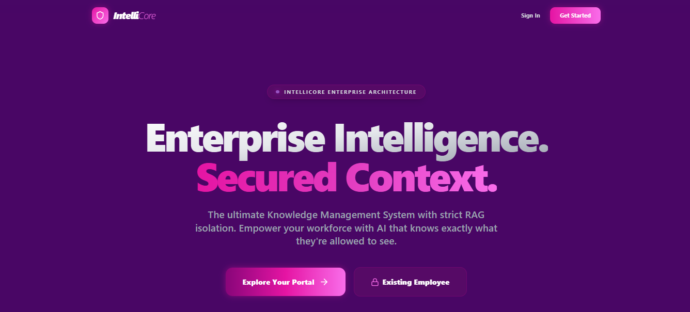
</p>

### 👥 Employee Portal
<p align="center">
  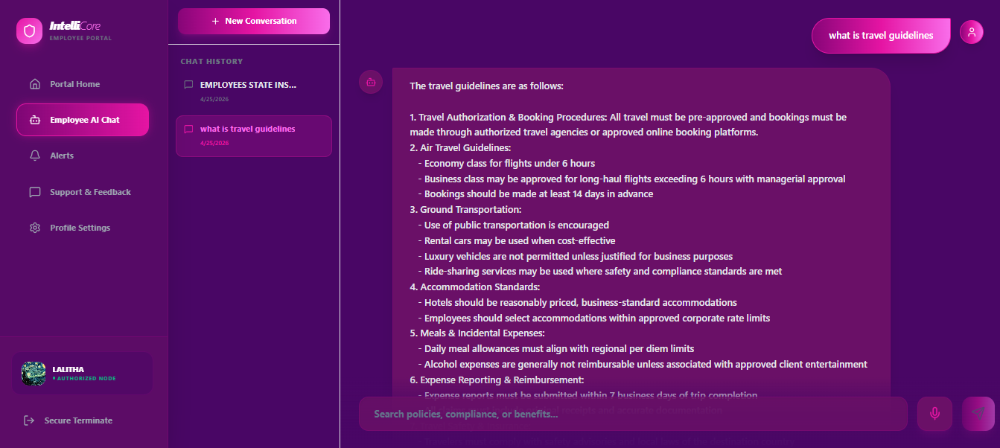
  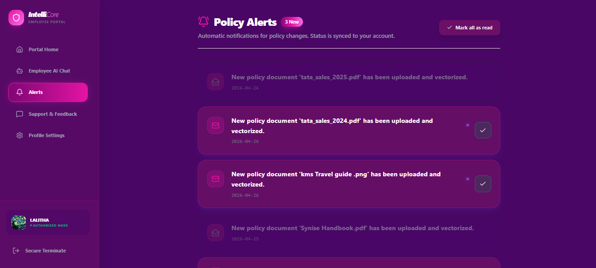
</p>
<p align="center">
  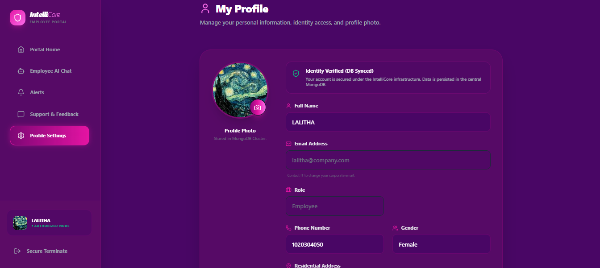
  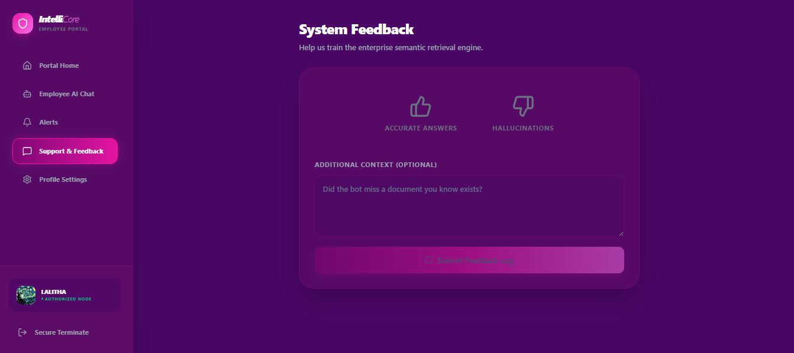
</p>

### 🛡️ Policy Administrator Dashboard
<p align="center">
  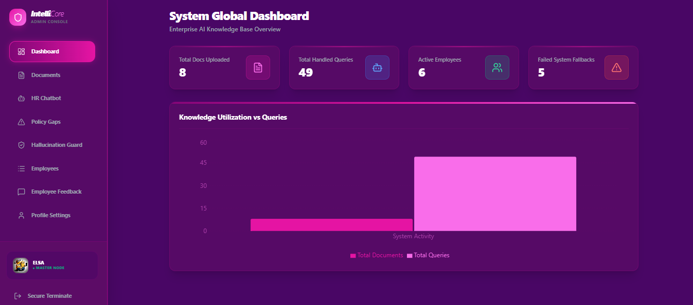
  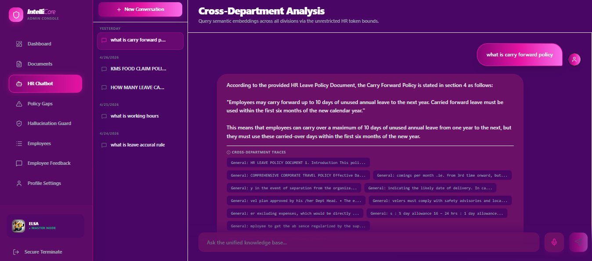
</p>
<p align="center">
  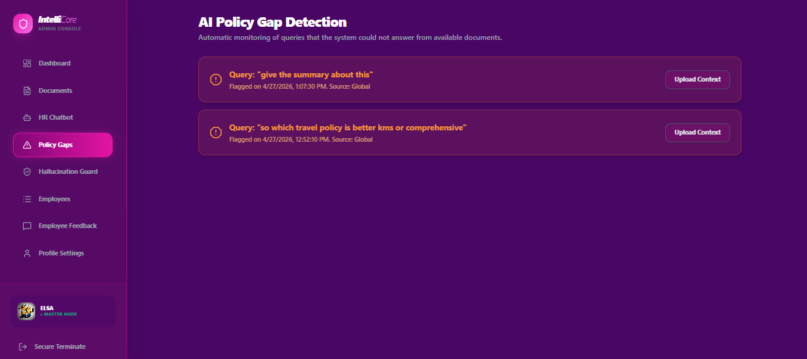
  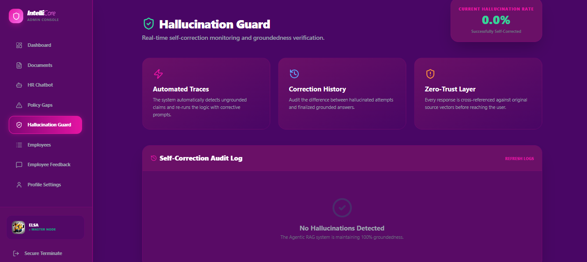
</p>
<p align="center">
  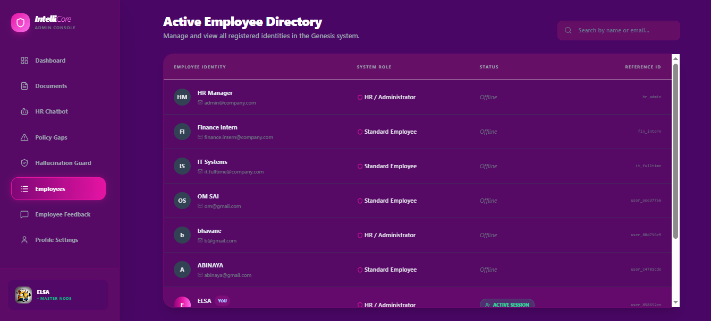
  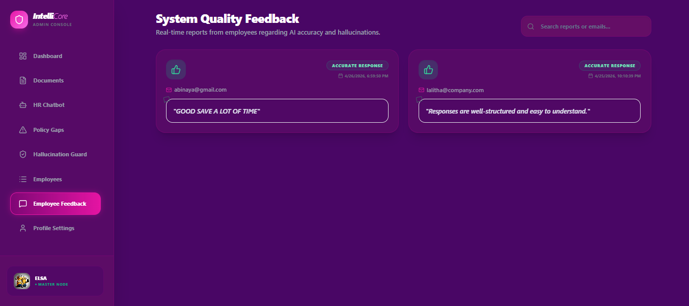
</p>
<p align="center">
  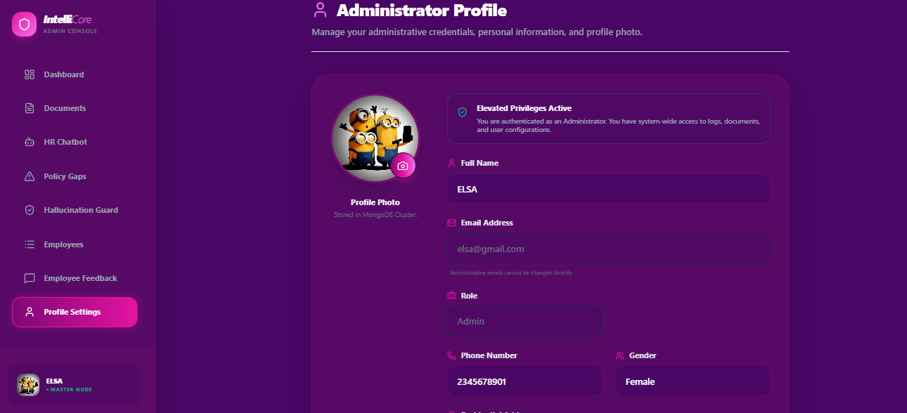
</p>

---

## 🏁 Conclusion

IntelliCore represents a leap forward in enterprise knowledge accessibility. By combining the precision of **RAG**, the flexibility of the **Model Context Protocol**, and the reasoning power of **Llama 3.3**, it transforms static policy documents into a dynamic, interactive, and observable knowledge asset. It not only empowers employees with instant, accurate information but also provides administrators with the analytical tools needed to maintain a robust and comprehensive knowledge base.

---
